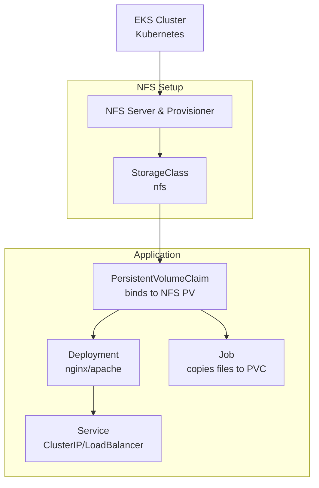

# Commends to run the application:
## kubectl setup
```
curl -LO "https://dl.k8s.io/release/$(curl -L -s https://dl.k8s.io/release/stable.txt)/bin/darwin/arm64/kubectl"
chmod +x kubectl
sudo mv kubectl /usr/local/bin/
```
## aws cluster creation
```
aws eks create-cluster --region us-east-1 --name lsc-cluster --role-arn arn:aws:iam::810714271038:role/LabRole --resources-vpc-config subnetIds=subnet-010b83e6853537b57,subnet-08066cc83ffba6d0a
```
## aws nodes creation
```
aws eks create-nodegroup --region us-east-1 --cluster-name lsc-cluster --nodegroup-name lsc-ng --node-role arn:aws:iam::810714271038:role/LabRole --subnet subnet-010b83e6853537b57 subnet-08066cc83ffba6d0a --instance-types t3.medium --scaling-config minSize=1,maxSize=2,desiredSize=1 --disk-size 20 --ami-type AL2_x86_64
```
### check cluster status
```
aws eks describe-cluster --region us-east-1 --name lsc-cluster  --query cluster.status
```
## kubctl config update
```
aws eks --region us-east-1 update-kubeconfig --name lsc-cluster
```
## helm installation
```
curl https://raw.githubusercontent.com/helm/helm/master/scripts/get-helm-3 > get_helm.sh
chmod 700 get_helm.sh
./get_helm.sh
```
## NFS installation
```
helm repo add nfs-ganesha-server-and-external-provisioner https://kubernetes-sigs.github.io/nfs-ganesha-server-and-external-provisioner/
helm install nfs-server-provisioner nfs-ganesha-server-and-external-provisioner/nfs-server-provisioner -f ./config_files/nfs-config.yaml
```
## config files application
```
kubectl apply -f ./config_files/persistent_volume_claim.yaml
kubectl apply -f ./config_files/deployment.yaml
kubectl apply -f ./config_files/service.yaml
kubectl apply -f ./config_files/job.yaml
```
## get http-service url
```
kubectl get service lsc-service
```
# Components chars


Diagram Explanation:

    EKS Cluster: Base Kubernetes environment.

    NFS server & provisioner: The NFS Server provides shared network storage for pods using the NFS protocol, while the NFS Provisioner dynamically creates PersistentVolumes (PVs) 

    StorageClass (nfs): Defines dynamic provisioning parameters for NFS.

    PersistentVolumeClaim: Requests storage bound to NFS-backed persistent volume.

    Deployment: Runs HTTP server (nginx) with PVC-mounted web root.

    Job: Copies sample (index.html) file to the shared PVC (accessible by HTTP server).

    Service: Exposes the Deployment (ClusterIP for internal access or LoadBalancer for external).
